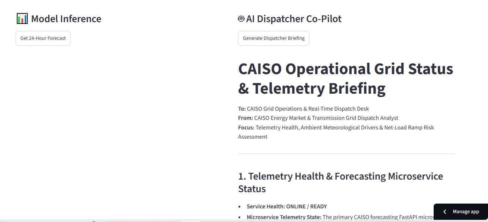

# CAISO Grid Load Forecasting: End-to-End MLOps Pipeline
[](https://caiso-grid-load-forecasting-koj7j4lyxtfjtbkzffsw9j.streamlit.app/))

🔗 **Live Interactive Demo:** [CAISO Grid Load Forecasting Dashboard](https://caiso-grid-load-forecasting-koj7j4lyxtfjtbkzffsw9j.streamlit.app/))
## Project Overview
This project implements a Temporal Fusion Transformer (TFT) to forecast 168-hour electricity grid loads for the California Independent System Operator (CAISO). The deep learning model significantly outperforms traditional XGBoost baselines in both RMSE and MAE metrics by capturing complex multi-horizon temporal dependencies. 

The trained model is operationalized as a microservice and connected to an interactive front-end, demonstrating a complete end-to-end data science deployment pipeline.

## Tech Stack
* **Machine Learning:** PyTorch Forecasting, PyTorch Lightning, Pandas, NumPy
* **API Backend:** FastAPI, Uvicorn
* **Frontend UI:** Streamlit
* **Environment:** Google Colab, Google Drive Integration

## Architecture
1. **Model Training:** A TFT neural network trained on 5 years of historical CAISO load data, optimizing for multi-step time series forecasting.
2. **REST API:** The saved model weights (`.ckpt`) are loaded into a FastAPI microservice that exposes a `/predict` endpoint.
3. **Interactive Dashboard:** A Streamlit web application consumes the FastAPI endpoint, allowing users to request and visualize 24-hour to 168-hour forecasts on demand.
---

## 🤖 Autonomous AI Grid Dispatcher & Decision Support

Beyond passive predictive forecasting, the platform features an autonomous, multi-tool AI Agent co-pilot designed to support CAISO real-time transmission and market dispatch operations. Built using **LangChain** and **Google Gemini (`gemini-3.8-flash`)**, the agent autonomously orchestrates multi-source external tools to diagnose telemetry health, evaluate meteorological risk drivers, and compile executive-ready dispatch briefings on demand.

### System Architecture & Autonomous Workflow

### System Architecture & Autonomous Workflow

```text
       +-----------------------------------------------------+
       |               User / Grid Dispatcher                |
       |       "Generate Executive Dispatcher Briefing"      |
       +--------------------------+--------------------------+
                                  |
                                  v
              +---------------------------------------+
              |    LangChain ReAct Agent Executor     |
              |       (Powered by Gemini Flash)       |
              +---------+-------------------+---------+
                        |                   |
        [Tool 1 Call]   |                   |   [Tool 2 Call]
                        v                   v
      +------------------------+     +------------------------+
      |  Render FastAPI Service |     |    Open-Meteo API      |
      |  GET /predict          |     |  Real-time CA Weather  |
      |  Telemetry & Readiness |     |  Temp, Humidity, Wind  |
      +-----------+------------+     +-----------+------------+
                  |                              |
                  +--------------+---------------+
                                 | [Telemetry & Weather State]
                                 v
              +---------------------------------------+
              |   Thermodynamic & Risk Synthesizer   |
              |  - Net-Load "Duck Curve" Steepness   |
              |  - BESS State-of-Charge Planning     |
              |  - Path 26/46/66 Transfer Headroom   |
              +-------------------+-------------------+
                                  |
                                  v
              +---------------------------------------+
              |   Live Executive Briefing Rendered   |
              |        (Streamlit UI Interface)       |
              +---------------------------------------+
```

          
### Autonomous Tool Stack

1. **`fetch_caiso_load_forecast`**: Programmatically interfaces with the live FastAPI microservice on Render to verify model ingestion readiness for multi-horizon forward dispatch scheduling.
2. **`fetch_california_ambient_weather`**: Ingests real-time meteorological metrics (dry-bulb temperature, apparent heat index, relative humidity, and wind velocity) for the Southern California load basin via Open-Meteo.

### Operational Intelligence Capabilities

* **Thermodynamic Demand Impact:** Translates ambient temperature and humidity extremes into Cooling Degree Days (CDD) and assesses latent heat retention risks that prolong evening HVAC consumption.
* **Duck-Curve Net-Load Transition:** Evaluates late-afternoon solar cliff drop-offs against current onshore wind output to assess ramping pressure ($MW / \Delta t$).
* **Actionable Dispatch Protocols:** Formulates prescriptive operating recommendations, including Battery Energy Storage System (BESS) state-of-charge management, short-start peaker commitments, and regional intertie transfer monitoring (Path 26, Path 46, and Path 66).

### Production Interface Preview



## Project Structure
* `01_CAISO_Data_Pipeline_and_Baseline.ipynb`: Ingestion pipeline (GridStatus + Open-Meteo) and baseline model benchmarks.
* `02caiso_load_forecasting_tft.ipynb`: Deep learning Temporal Fusion Transformer architecture and multi-quantile evaluations.
* `api.py`: FastAPI server script handling model inference.
* `dashboard.py`: Streamlit interface with interactive predictions and autonomous AI agent dispatch briefings.
* `requirements.txt`: Application and agent dependencies.
